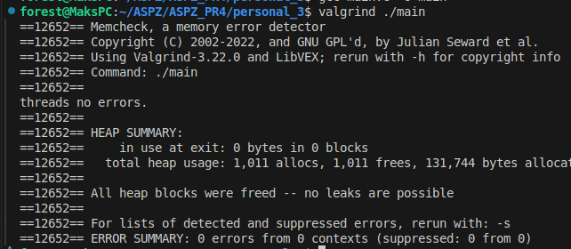

# Завдання 4.1

Скільки пам’яті може виділити malloc(3) за один виклик?

Параметр malloc(3) є цілим числом типу даних size_t, тому логічно максимальне число, яке можна передати як параметр malloc(3), — це максимальне значення size_t на платформі (sizeof(size_t)). У 64-бітній Linux size_t становить 8 байтів, тобто 8 * 8 = 64 біти. Відповідно, максимальний обсяг пам’яті, який може бути виділений за один виклик malloc(3), дорівнює 2^64. Спробуйте запустити код на x86_64 та x86. Чому теоретично максимальний обсяг складає 8 ексабайт, а не 16?
## Рішення

#### У цьому завданні я досліджував, який максимально можливий обсяг памʼяті можна виділити за допомогою 'malloc()'.

#### Тип 'size_t' у 64-бітній системі займає 8 байтів, тобто 64 біти. Теоретично це дозволяє передати 'malloc()' значення до 2^64 байтів — 16 ексабайтів. Проте на практиці максимально можна виділити лише до 2^63 байтів (8 ексабайтів).

#### Це обмеження пов’язане з тим, що операційні системи зазвичай не використовують старший біт. Він резервується для внутрішніх потреб, таких як адресація простору ядра, сумісність або захист памʼяті.

#### У коді я реалізував програму, яка виводить розмір 'size_t' (8 байтів) і його максимальне значення

# Завдання 4.2

Що станеться, якщо передати malloc(3) від’ємний аргумент? Напишіть тестовий випадок, який обчислює кількість виділених байтів за формулою num = xa * xb. Що буде, якщо num оголошене як цілочисельна змінна зі знаком, а результат множення призведе до переповнення? Як себе поведе malloc(3)? Запустіть програму на x86_64 і x86.

## Рішення

#### У цьому завданні я написав програму, що навмисне викликає переповнення змінної 'num', й в результаті ця змінна отримує - значення.

#### Далі програма передає значення 'num' в 'malloc()', вона намагається перетворити число в 'size_t' (без знаку), але оскільки значення завелике, то воно просто повертає null й при перевірці програма повертає повідомлення з помилкою.

# Завдання 4.3

Що станеться, якщо використати malloc(0)? Напишіть тестовий випадок, у якому malloc(3) повертає NULL або вказівник, що не є NULL, і який можна передати у free(). Відкомпілюйте та запустіть через ltrace. Поясніть поведінку програми.
## Рішення

#### У цьому завданні, досліджував поведінку 'malloc()', а саме його поведінку з переданим значенням '0'. В такому випадку 'malloc()' може повернути або null або вказівник. 

#### В результаті виконання тесту, видно, що 'malloc(0)' повертає адресу пам'яті й відповідно, її можна звільнити.

# Завдання 4.4

Чи є помилки у такому коді?

void *ptr = NULL;

while (some-condition-is-true) {

    if (!ptr)

        ptr = malloc(n);

    [... використання 'ptr' ...]

    free(ptr);

}

Напишіть тестовий випадок, який продемонструє проблему та правильний варіант коду.

## Рішення

#### У цій програмі спочатку перевіряється наданий код, що має помилку. В цьому коді головною проблемою є лише одне виділення пам'яті, коли 'ptr = null', але при цьому ми звільняємо її кожну ітерацію, що й викликає помилку

#### У виправленій версії, я дода лише 1 строчку кода, що в кінці циклу буде заново призначати змінній значення null, й через це буде викликатись нове виділення пам'яті.

# Завдання 4.5

**Що станеться, якщо realloc(3) не зможе виділити пам’ять? Напишіть тестовий випадок, що демонструє цей сценарій.

## Рішення

#### У цьому завданні для перевірки обмеження 'realloc()', я написав програму, що спробує заново виділити пам'ять дуже великому числу, через це викликається помилка, й нова пам'ять не була виділена. 

#### Оскільки нова пам'ять не була виділена, то старий вказівник все ще працює, і його треба очистити.

# Завдання 4.6

Якщо realloc(3) викликати з NULL або розміром 0, що станеться? Напишіть тестовий випадок.

## Рішення

#### У цьому завданні для перевірки обмеження 'realloc', спочатку була перевірка 'realloc(NULL, 100)', що в результаті поводиться, як просте виділення пам'яті, як malloc(100).

#### В наступному виділенні було викликано 'realloc(ptr1, 0)', в такому разі це очищує пам'ять вказівника 'ptr1'. Як викновок realloc() може як звільняти пам'ять (free) вказівника так і виділяти її (malloc).

# Завдання 4.7

Перепишіть наступний код, використовуючи reallocarray(3):

struct sbar *ptr, *newptr;

ptr = calloc(1000, sizeof(struct sbar));

newptr = realloc(ptr, 500*sizeof(struct sbar));

Порівняйте результати виконання з використанням ltrace.

## Рішення

#### У цьому завданні я переписав програму за умовою, та доповнив її перевірками на виділення пам'яті. Спочатку програма викликає 'calloc(1000, sizeof(struct sbar))', виділяє пам'ять та згодом викликає 'reallocarray(ptr, 500*sizeof(struct sbar))' для зменшення розміру з 1000 на 500 елементів, що в результаті виконання також повертає вказівник.

#### Загалом 'reallocarray()' є більш безпечним ніж 'realloc()', бо може запобігти переповненню.

# Особисте завдання '3 Варіант'

Досліджуйте поведінку malloc у багатопоточному середовищі.

## Рішення

#### У цій програмі я перевіряв поведінку 'malloc()'  у багатопоточному середовищі. Для цього в моїй програмі я створив нові потоки, де був цикл, що багато разів виділяв та очищував пам'ять для кожного з потоків, якщо виділення не вдавалось, то програма повертала помилку, що пам'ять не вдалось виділити. 

#### Також за додаткової перевірки з 'valgrind 'можна сказати, що жодних помилок не було виявлено, і з 'malloc()' можна безпечно працювати в багатопоточному середовищі.

